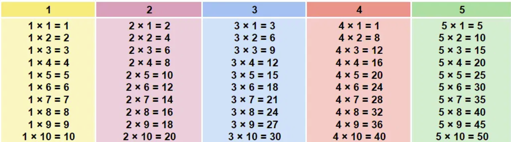

# Dasar-dasar PHP

## Variabel

- Variabel digunakan untuk menyimpan data berupa teks, angka dan sebagainya yang nilainya dapat diubah-ubah.
- Nama variabel bisa apa saja asal mengikuti aturan berikut:
  - Nama variabel hanya boleh mengandung huruf, angka dan *underscore*.
  - Nama variabel yang terdiri lebih dari satu kata dapat dipisahkan dengan *underscore*.
  - Nama variabel tidak boleh menggunakan kata yang merupakan bagian dari skrip PHP.
  - Penulisan nama variabel harus diawali dengan tanda dolar `$`.
  - Variabel bersifat *case-sensitive*, sehingga huruf besar dan huruf kecil dibedakan.

Contoh membuat variabel. Ketikkan kode berikut dan jalankan atau buka di dalam browser.

```php
<?php
$kata = "Semangat pagi kawan..!";
echo $kata;
?>
```

## Tipe Data

Variabel pada PHP dapat menyimpan berbagai macam tipe data, di antaranya:

- **String**, yaitu teks. Contoh: "Selamat Pagi" atau "123"
- **Integer**, yaitu angka non-desimal. Contoh: 1, 100, -400
- **Float**, yaitu tipe data angka desimal. Contoh: 23.5
- **Boolean**, tipe data yang hanya bernilai `true` atau `false` saja
- **Array**, yaitu tipe data yang menyimpan banyak nilai dalam satu variabel
- **Object**, yaitu tipe data yang menyimpan data beserta informasi bagaimana data diproses
- **Null**, yaitu tipe data yang hanya bernilai `NULL`

Contoh:
```php
<?php
$nama = "Joko";
$umur = 17;

var_dump($nama);
var_dump($umur);
?>
```

## Konstanta

- Konstanta digunakan untuk menyimpan nilai sederhana.
- Sekali didefinisikan/ dibuat, nilai konstanta tidak dapat dirubah, jika dirubah/ diisi ulang maka akan error.
- Penulisan nama konstanta sama dengan variabel, namun tidak menggunakan tanda `$`.
- *Best Practice* penulisan nama konstanta adalah dengan huruf kapital.

Contoh membuat konstanta

```php
<?php
define("APP","Aplikasi Siswa");
define("VERSION","1.0");

echo APP . " Versi " . VERSION;
?>
```

## Operator

- Setiap bahasa pemrograman pasti memiliki operator.
- Operator digunakan untuk melakukan operasi terhadap satu atau lebih data, atau variabel, sehingga menghasilkan data baru

### Operator Aritmatika

Operator aritmatika merupakan operator untuk melakukan perhitungan aritmatika.

|Operator|Fungsi|
|:-:|-|
|+|Penjumlahan|
|-|Pengurangan|
|*|Perkalian|
|/|Pembagian|
|%|Modulus/ Sisa hasil bagi|

Contoh

```php
<?php
$x = 5;
$y = 2;

echo "$x + $y = " . $x + $y . "<br>";
echo "$x - $y = " . $x - $y . "<br>";
echo "$x * $y = " . $x * $y . "<br>";
echo "$x / $y = " . $x / $y . "<br>";
echo "$x % $y = " . $x % $y . "<br>";
?>
```

### Operator Perbandingan

Digunakan untuk membandingkan 2 nilai atau variabel, hasilnya adalah **true** atau **false**.

|Operator|Arti|
|-|-|
|==|Sama dengan|
|===|Identik-sama dengan|
|!= atau <>|Tidak sama dengan|
|!==|Tidak identik|
|>|Lebih besar|
|<|Lebih kecil|
|<= |Lebih kecil atau sama dengan|
|>=|Lebih besar atau sama dengan|

Contoh:

```php
<?php
$x = "5";
$y = 5;

var_dump($x == $y);
var_dump($x === $y);
var_dump($x != $y);
var_dump($x !== $y);
var_dump($x > $y);
var_dump($x < $y);
var_dump($x >= $y);
var_dump($x <= $y);
?>
```

### Operator Logika

Operator logika digunakan untuk menggabungkan dua pernyataan atau lebih, hasilnya **true** atau **false**.

|Operator|Arti|
|-|-|
|`and` atau `&&`|Benar jika kedua pernyataan benar|
|`or` atau `\|\|` |Benar jika salah satu atau keduanya bernilai benar|
|`xor`|Benar jika salah satu pernyataan bernilai benar, tetapi tidak keduanya|
|`!`|Benar jika pernyataanya salah|

### Operator Increment dan Decrement

Operator ini digunakan untuk menambahkan atau mengurangi nilai variabel.

|Operator|Nama|Keterangan|
|:-:|:-:|-|
|++$x|Pre-increment|Menambahkan variabel $x dengan 1, lalu mengembalikan nilai $x|
|$x++|Post-increment|Mengembalikan variabel $x, kemudian menambahkan nilai $x dengan 1|
|--$x|Pre-decrement|Mengurangi variabel $x dengan 1, lalu mengembalikan nilai $x|
|$x--|Post-decrement|Mengembalikan variabel $x, kemudian mengurangi dengan 1|

### Operator Assigment

Operator ini digunakan untuk menentukan atau mengubah nilai suatu variabel numerik.

|Assigment|Sama dengan|Keterangan|
|-|-|-|
|$x = $y|$x = $y|Nilai x sama dengan nilai y|
|$x += $y|$x = $x + $y|Nilai x ditambahkan dengan nilai y|
|$x -= $y|$x = $x - $y|Nilai x dikurangi dengan nilai y|
|$x *= $y|$x = $x * $y|Nilai x dikalikan dengan nilai y|
|$x /= $y|$x = $x / $y|Nilai x dibagi dengan nilai y|
|$x %= $y|$x = $x % $y|Nilai x modulus dengan nilai y|

### Operator String

Operator ini digunakan untuk menggabungkan tipe data string.

|Operator|Contoh|
|:-:|-|
|`.`|`$kata = "Saya sedang"."belajar PHP";`|
|`.=`|`$kata .= "dengan Semangat";`|

### Operator Kondisi

- Operator ini digunakan untuk memberikan nilai pada suatu variabel sesuai kondisi yang ditentukan.
- Jika kondisi **true** maka akan diberi nilai dengan nilai sebelah kiri tanda `:`
- Jika kondisi **false** maka akan diberi nilai dengan nilai sebelah kanan tanda `:`
- Kondisi diletakkan di dalam kurung diikuti dengan tanda `?` yang memisahkan dengan nilai.
- Formatnya `? ... : ...`

## Array

Array merupakan variabel khusus yang dapat menyimpan nilai lebih dari satu.

Beberapa jenis array:
- Array Numerik
- Array Asosiatif
- Array 1 dimensi
- Array 2 dimensi/ multi-dimensi

Contoh:

```php
<?php
// Array Numerik
$hari = [
    "Senin",
    "Selasa",
    "Rabu",
    "Kamis",
    "Jum'at",
    "Sabtu",
    "Ahad"
];
var_dump($hari);

// Array Asosiatif
$siswa = [
    "nama" => "Joko Santoso",
    "kelas" => 11,
    "jurusan" => "PPLG"
];
var_dump($siswa);

// Array 2 dimensi/ multi-dimensi
$pegawai = [
    "nama" => "Rudi Hermanto",
    "alamat" => [
        "desa" => "Rejosari",
        "kec" => "Kebonsari",
        "kab" => "Madiun"
    ]
];
var_dump($pegawai);
?>
```

## Statement Control

- Statement control akan mengatur bagaimana data akan ditampilkan sesuai dengan kondisi tertentu
- Statement control menjadi kunci dari logika program
- Kesalahan dalam penggunaan statement control mungkin tidak menampilkan pesan error, tetapi aplikasi tidak berjalan sesuai semestinya.

### Percabangan `IF`

Statement control ini digunakan untuk menjalankan suatu program tertentu jika sebuah sayrat kondisi terpenuhi. Formatnya adalah...

```php
if (kondisi) statement;
```

Contoh:

```php
<?php
$login = true;
if($login) echo "Selamat Datang";
?>
```

Format di atas berlaku jika statement-nya hanya satu baris. Jika lebih dari satu baris, maka statement-nya menjadi:

```php
if (kondisi){
    statement1;
    statement2;
    // dan seterusnya...
}
```
Contoh:

```php
<?php
$nama = "Joko";
$nilai = 80;

if($nilai >= 80){
    echo "Selamat $nama,";
    echo "Anda dinyatakan lulus..!";
}

if($nilai < 80){
    echo "Maaf $nama,";
    echo "Anda dinyatakan belum lulus..!";
}
?>
```
!!! bug "Testing"
    Sekarang coba ubah nilai 80 menjadi 70 dan jalankan skripnya. Apa hasilnya?

### Percabangan `IF-ELSE`

Statement control ini digunakan menjalankan program tertentu jika sebuah kondisi terpenuhi, sekaligus menyediakan alternatif lain jika kondisi tidak terpenuhi. Format penulisannya adalah

```php
<?php
if(kondisi){
    // statement jika benar
    statement1;
    statement2;
}else{
    // statement jika salah
    statement1;
    statement2;
}
?>
```

Format di atas digunakan jika statement-nya lebihd dari satu, namun jika statement-nya hanya satu, bisa menggunaka format berikut.

```php
<?php
if(kondisi) //statement jika benar;
else //statement jika salah;
?>
```

Mari kita buat contohnya.

```php
<?php
// statement 1 baris
$nilai = 80;
if($nilai>=80) echo "Anda lulus";
else echo "Maaf, anda belum lulus";

// statement 2 baris
$nilai = 70;
if($nilai >= 80){
    echo "Selamat, Anda lulus";
}else{
    echo "Maaf, Anda belum lulus";
}
?>
```

### Percabangan `IF-ELSEIF-ELSE`

- Statement control ini digunakan untuk mengecek kondisi berikutnya ketika kondisi pertama tidak terpenuhi.
- Jika semua kondisi tidak terpenuhi, maka dijalankan statement setelah `else`.


Format sintakasnya

```php
<?php
if(kondisi1){
    // statement jika kondisi 1 benar
}elseif(kondisi2){
    // statement jika kondisi 2 benar
}else{
    // statement jika semua kondisi salah
}
?>
```

**MARKICOB** (Mari kita coba...😊)

```php
<?php
$nilai = 85;

if($nilai<60){
    echo "Nilai : $nilai\n";
    echo "Grade : E";  
}elseif($nilai<70){
    echo "Nilai : $nilai\n";
    echo "Grade : D";
}elseif($nilai<80){
    echo "Nilai : $nilai\n";
    echo "Grade : C";
}elseif($nilai<90){
    echo "Nilai : $nilai\n";
    echo "Grade : B";
}elseif($nilai<=100){
    echo "Nilai : A";
}else{
    echo "Maaf nilai tidak sah";
}
?>
```
!!! example "Eksperimen"
    Sekarang agar lebih interaktif, coba tambahkan fungsi php untuk mengambil input user, yaitu dengan mengganti `$nilai = 80;` menjadi
    ```php
    <?php
    echo "Masukkan nilai : ";
    $nilai = fgets(STDIN);
    ?>
    ```
### Percabangan `SWITCH`

- Statement control ini digunakan untuk menjalankan program pada setiap kemungkinan nilai dari sebuah  variabel.
- Ini fungsinya hampir sama dengan `IF`, namun untuk penggunaan yang lebih sederhana.

Formatnya adalah

```php
<?php
switch($variabel){
    case "option1": statement1;
    break;
    case "option2": statement2;
    break;
    default: statement3;
    break;
}
?>
```
!!! note "Catatan"
    - Statement pada `default` akan dijalankan ketika semua option sebelumnya tidak terpenuhi.
    - Setiap statement harus dikuti dengan `break;` untuk menghentikan proses pengecekan kepada option selanjutnya.

Berikut contohnya

```php
<?php
$kode = 1;

switch($kode){
    case 1:
        echo "Selamat datang Admin";
        break;
    case 2:
        echo "Selamat datang User";
        break;
    case 3:
        echo "Selamat datang Tamu";
        break;
    default:
        echo "Maaf, Akses ditolak..!";
        break;
}
?>
```
!!! example "Percobaan"
    Seperti sebelumnya, agar lebih interaktif, coba buat aagr nilai `$kode` diinput langsung dari user dan sebelumnya tampilkan teks `Masukkan Kode Rahasia`.

### Perulangan `WHILE`

While digunakan untuk menjalankan program secara berulang-ulang selama kondisi masih terpenuhi. Format penulisannya adalah

```php
<?php
while(kondisi){
    statement;
}
?>
```

Mari kita buat contohnya

```php
<?php
$no = 1;
while($no <= 10){
    echo "Antrian ke-$no \n";
    $no++;
}
?>
```

!!! warning "Peringatan"
    - Hati-hati dalam membuat perulangan, baik **while** atau yang lain, pastikan kamu membuat counter dan batas perulangannya, karena kalau tidak, bisa saja perulangan kamu akan terus dilakukan sampai memori komputer penuh yang akhirnya membuat komputer kamu mati.
    - Dalam contoh di atas, betasan perulangannya adalah `$no <=10` dan penambah counter `$no++`.
    - Kalau program dijalankan dengan terminal/ command promt, cara menghentikannya adalah dengan menekan tombol ++ctrl+c++ , tetapi jika perulangan dijalankan di sisi server menggunakan browser, bisa-bisa servernya yang terjadi *memory overflow* dan mati.

!!! example "Percobaan"
    - Sekarang coba buat sebuah perkalian berulang seperti dulu ketika kamu masih di bangku sekolah dasar kamu diminta untuk menghafalkan daftar perkalian!, masih ingat?
    - Contoh hasilnya seperti berikut
    

### Perulangan `DO-WHILE`

- Hampir sama seperti **wbile**, statement control ini digunakan untuk menjalankan program secara berulang-ulang selama kondisi terpenuhi.
- Bedanya, kalau **do-while**, statement-nya dijalankan terlebih dahulu, tanpa harus mengecek kondisinya terlebih dahulu.
- Hal ini memungkinkan perulangan **do-while** melakukan minimal 1 kali, walaupun kondisinya tidak terpenuhi.

Format sintaksnya adalah

```php
<?php
do{
    statement;
}while(kondisi);
?>
```

Berikut contohnya

```php
<?php
$angka = 100;
do{
    echo "Hitungan ke $angka\n";
    $angka++;
}while($angka<=10);
?>
```

Perulangan di atas dirasa agak aneh, padahal kan perulangannya, harusnya dilakukan ketika variabel `$angka` bernilai lebih kecil atau sama dengan 10, namun begitulah cara kerja perulangan **do-while**.

### Perulangan `FOR`

- Secara prinsip, statement control ini sama seperti perulangan while dan do-while.
- Namun, saat menggunakan perulangan **for**, kita langsung menentukan batas awal dan akhir perulangannya.
- Formatnya sebagai berikut.

```php
<?php
for(init_statement ; kondisi ; post_statement){
    // blok perulangan
}
?>
```

!!! note "Catatan"
    - Init statement akan dieksekusi hanya sekali di awal sebelum perulangan
    - Kondisi akan dilakukan pengecekan dalam setiap perulangan, jika true perulangan akan dilakukan, jika false perulangan akan berhenti
    - Post statement akan dieksekusi setiap kali diakhir perulangan
    - Init statement, Kondisi dan Post Statement tidak wajib diisi, jika Kondisi tidak diisi, berarti kondisi selalu bernilai true

**Contoh-1**
```php
<?php
// Perulangan for tanpa henti
for(;;){
    echo "Saya berjanji tidak akan membolos lagi\n\n";
}
?>
```

**Contoh-2**
```php
<?php
// Perulangan for dengan kondisi
$counter = 1;
for(;$counter<=10;){
    echo "Antrian ke-$counter\n";
    $counter++;
}
?>
```
**Contoh-3**
```php
<?php
// Perulangan for dengan init statement
for($counter=11; $counter<=25;){
    echo "Antrian ke : $counter\n";
    $counter++;
}
?>
```

**Contoh-4**
```php
<?php
// Perulangan for dengan post-statement
for($i=1; $i<=100; $i++){
    echo "Antrian Sembako ke-$i\n";
}
?>
```

### Perulangan `FOREACH`

Statement control ini digunakan khusus untuk melakukan perulangan pada data array. Format penulisannya

```php
<?php
foreach($variabel as $alias){
    statement;
}
?>
```

Jika jenis array-nya array asosiatif, maka formatnya

```php
<?php
foreach($variabel as $key => $value){
    statement;
}
?>
```

**Contoh-1**
```php
<?php
// Foreach array numerik
$buah = ["Jeruk","Mangga","Apel"];
echo "Es ";
foreach($buah as $b){
    echo "$b, ";
}
echo "Sori nggak level..!😊";
?>
```

Jalankan dan baca dengan intonasi, xixixi 🤭

**Contoh-2**
```php
<?php
// Foreach dengan array asosiatif
$siswa=[
    "nama" => "Dita Leni Ravia",
    "kelas" => 11,
    "jurusan" => "PPLG"
];

foreach($siswa as $key => $value){
    echo "$key : $value \n";
}
?>
```

!!! question "Tantangan"
    - Sekarang coba buat array 2 dimensi seperti berlikut, amati dengan baik, lalu gunakan perulangan foreach untuk menampilkan seluruh datanya. Clue-nya adalah `foreach bersarang`.
        ```php
        <?php
        // Foreach dengan array 2 dimensi
        $siswa=[
            [
                "nis" => 881,
                "nama" => "Roro Jonggrang",
                "nilai" => 95
            ],
            [
                "nis" => 882,
                "nama" => "Roro Kidul",
                "nilai" => 100
            ],
            [
                "nis" => 883,
                "nama" => "Joko Tingkir",
                "nilai" => 90
            ]
            ];
        ?>
        ```
??? success "Buka Jawaban"
    ```php
    <?php
    // Foreach dengan array 2 dimensi
    $siswa=[
        [
            "nis" => 881,
            "nama" => "Roro Jonggrang",
            "nilai" => 95
        ],
        [
            "nis" => 882,
            "nama" => "Roro Kidul",
            "nilai" => 100
        ],
        [
            "nis" => 883,
            "nama" => "Joko Tingkir",
            "nilai" => 90
        ]
        ];

    foreach($siswa as $tokoh){
        foreach($tokoh as $data => $nilai){
            echo "$data : $nilai\n";
        }
    }
    ?>
    ```

## Modularitas

- Saat membuat aplikasi, ada baiknya tidak dibuat dalam satu file
Lebih baik dipisah ke beberapa file agar kode program tidak terlalu bertumpuk di satu file.
- PHP memiliki function **require** dan **include** yang bisa kita gunakan untuk mengambil file php lain.
- Lantas apa bedanya require dan include?
- Pada **require**, jika file yang kita ambil tidak ada, maka akan terjadi error dan program terhenti.
- Pada **include**, jika file yang kita ambil tidak ada, maka hanya akan memberi peringatan, namun program akan tetap dilanjutkan.

Sebagai contoh, kita buat file pertama yaitu **modul.php**

```php
<?php
echo "Halo.., Ini pesan dari file modul.php"
?>
```

Lalu kita buat file kedua, yaitu **include.php**

```php
<?php
echo "Ini pesan dari file include.php \n";
include "modul.php";
?>
```

Sekarang jalankan file **include.php**, maka perintah echo dari file `include.php` dan `modul.php` akan ditampilkan semuanya.


Satu lagi, coba buat file **require.php** sebagai berikut.

```php
<?php
require "fungsi.php";
echo "ini pesan dari file require.php \n";
?>
```

Jalankan skrip php di atas, dan apa hasilnya? 🤔

??? success "Benar"
    Muncul pesan **Error...** karena file yang dipanggil menggunakan `require` tidak ada, yaitu `fungsi.php`.

!!! abstract "Catatan Tambahan"
    - Function `require` dan `include` akan selalu mengambil file yang kita inginkan.
    - Jika kita beberapa kali menggunakan `require` dan `include` file yang sama, maka file tersebut akan berkali-kali pula kita ambil.
    - Hal ini akan menjadi masalah jika misal dalam file yang kita ambil terdapat definisi function , sehingga jika diambil berkali-kali akan menyebabkan error redeclare function.
    - Untungnya di PHP terdapat function `require_once` dan `include_once`, function ini bisa mendeteksi jika kita sebelumnya pernah mengambil file yang sama, maka tidak akan diambil lagi
